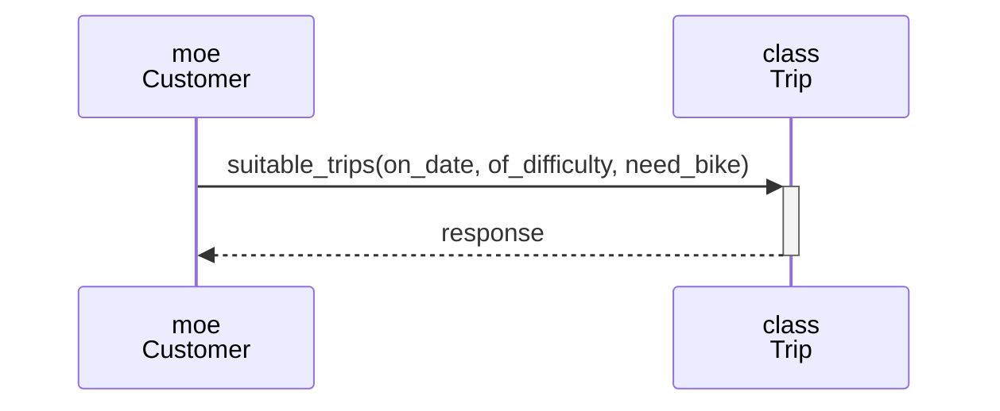
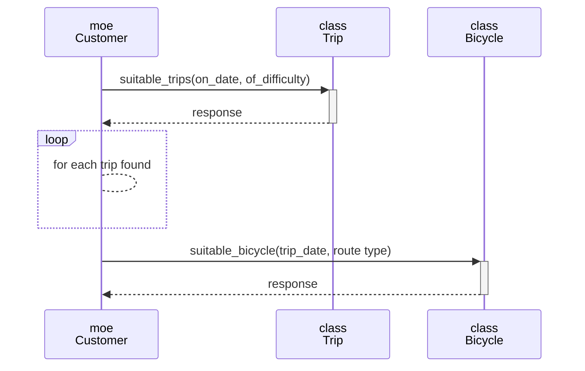
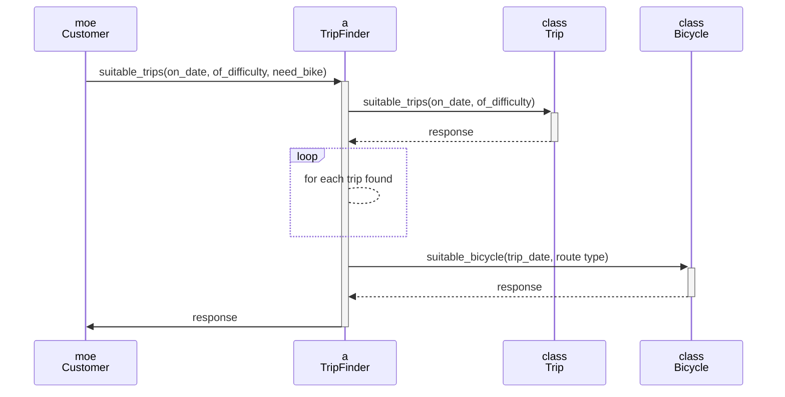

# 4.3 パブリックインターフェースを見つける
- [ ] suitable_tripsメッセージが複数クラス\(TripクラスとBicycleクラス\)の責任を持っている
- [ ] (need_bikeパラメータを持つ)suitable_tripsメッセージの受け取り手はTripクラスであるべきでない

- [ ] Customerに適切な旅行を探す処理が増えた
- [x] suitable_tripsメッセージが複数クラス\(TripクラスとBicycleクラス\)の責任を持っている
  - Bicycleクラスを作成し、MoeがBicycleに聞くように変更
- [x] (need_bikeパラメータを持つ)suitable_tripsメッセージの受け取り手はTripクラスであるべきでない
  - suitable_tripsメッセージから分離した箇所をsuitable_bicycleに実装
  - suitable_bicycleメッセージがBicycleの責任を持たせる

- [x] Customerに適切な旅行を探す処理が増えた
  - TripFinderクラスを作成し、旅行選定の責任を持たせる
- [x] suitable_tripsメッセージが複数クラス(TripクラスとBicycleクラス)の責任を持っている
  - Bicycleクラスを作成し、TripFinderがBicycleに聞くように変更
- [x] (need_bikeパラメータを持つ)suitable_tripsメッセージの受け取り手はTripクラスであるべきでない
  - suitable_tripsメッセージから分離した箇所をsuitable_bicycleに実装
  - suitable_bicycleメッセージがBicycleの責任を持たせる
